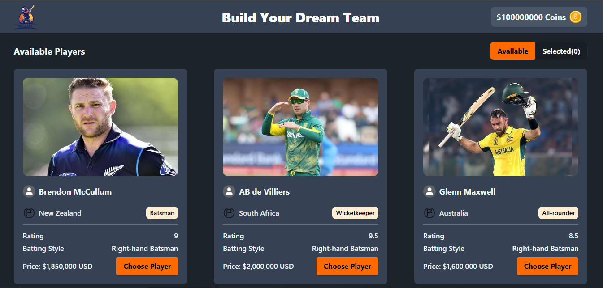
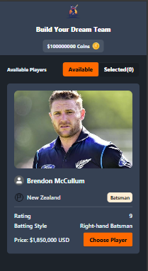

# Champions League Dream Team

A responsive React application where users build their own dream cricket
team by selecting players within a limited coin budget. The application
features player selection validation, real-time coin management,
interactive notifications, and a clean, responsive user interface.

------------------------------------------------------------------------

## Overview

**Champions League Dream Team** allows users to create their ideal cricket squad by purchasing players using virtual coins.

The application provides an interactive experience where users can:

-   Earn coins from the banner section
-   Browse available cricket players
-   Select players within the available coin balance
-   Prevent duplicate player selections
-   Limit team size to **6 players**
-   Remove selected players from the team
-   Receive instant notifications using **React Toastify**
-   Enjoy a fully responsive interface across desktop, tablet, and
    mobile devices

------------------------------------------------------------------------

## Live Demo

🔗 [View Live Demo](https://champions-league-twenty20.netlify.app/)

------------------------------------------------------------------------

## Tech Stack

| Layer | Technology |
|--------|------------|
| Frontend | React.js |
| Styling | Tailwind CSS, DaisyUI |
| Notifications | React Toastify |
| Language | JavaScript (ES6+) |
| Data Source | Local JSON |
| Build Tool | Vite |

------------------------------------------------------------------------

##  Features

### Coin Management

-   User starts with **0 coins**
-   Click **Claim Free Credit** to earn coins
-   Purchasing a player deducts the bidding price automatically

### Available Players

-   Display all players from a local JSON file
-   Show player image, name, country, role, batting/bowling type, and
    bidding price

### Player Selection

-   Purchase players using available coins
-   Prevent purchases when coins are insufficient

### Selected Players

-   Toggle between **Available** and **Selected**
-   Show selected player count
-   Remove players from the selected list

### Smart Validation

-   Prevent duplicate player selection
-   Maximum of **6 players**
-   User-friendly notifications using **React Toastify**

### Responsive Design

-   Responsive Navbar
-   Responsive Banner
-   Responsive Player Cards
-   Responsive Footer

------------------------------------------------------------------------

##  Key Highlights

-   Built with React functional components
-   Dynamic player rendering from JSON
-   Real-time coin management
-   Complete player selection validation
-   React Toastify notifications
-   Reusable component architecture
-   Fully responsive UI

------------------------------------------------------------------------

## UI Screenshots

### Home Page

### Mobile View

------------------------------------------------------------------------

##  Future Improvements

-   Save selected players in Local Storage
-   Search players
-   Filter by role and country
-   Sort by bidding price
-   Dark mode
-   Backend integration
-   Team persistence
-   Smooth animations

------------------------------------------------------------------------

## Author

**A S M Saim**

- GitHub: [@asm-saim](https://github.com/asm-saim)
- LinkedIn: [A S M Saim](https://www.linkedin.com/in/asmsaim/)